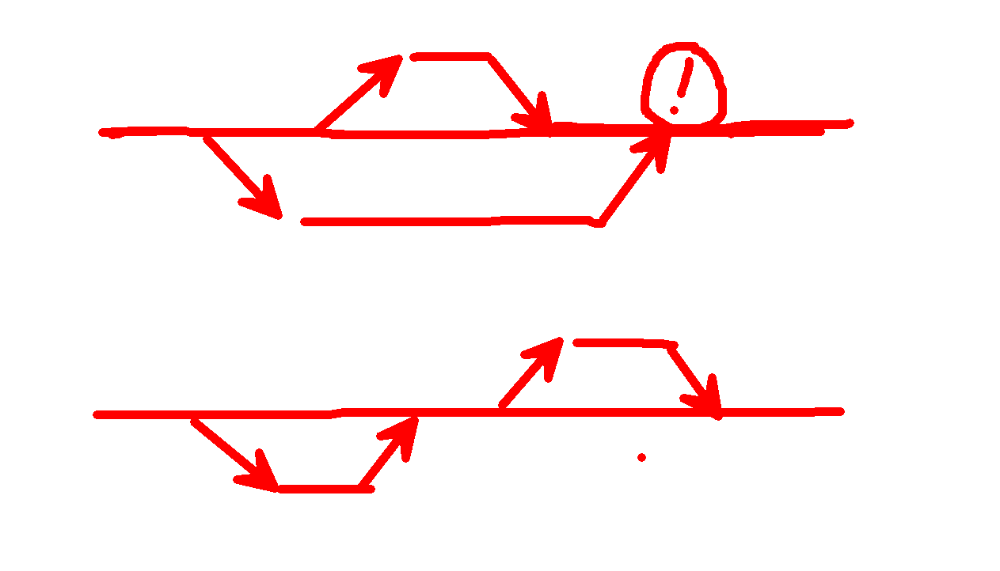

# 一、git简介

Git(读音为/gɪt/。)是一个开源的分布式版本控制系统，可以有效、高速地处理从很小到非常大的项目版本管理。 

> Git 是 Linus Torvalds 为了帮助管理 Linux 内核开发而开发的一个开放源码的版本控制软件。


# 二、代码版本管理工具

代码版本管理工具主流的就两个`SVN`和`git`，svn早期企业内部开发用的较多，git因为开源社区[github](http://github.com)和[oschina](http://oschina.net)而被大家认可和接收，逐渐变的流行起来。

# 三、git和svn的区别

git 的版本信息的管理是先提交至本地，然后通过push和pull命令来和服务器进行同步。

svn的版本信息是直接和服务器进行同步的。

两种同步模式有利有弊，svn过于依赖服务器，操作相对简单，git相对独立，操作相对繁琐。

git相对独立，操作相对繁琐。


# 四、客户端程序

1. 基于`svn`的服务器
   1. TortoiseSVN （svn可视化管理工具）
2. 基于`git`的服务器
   1. git for windows (命令行B格)
   2. TortoiseGit （git可视化管理工具）
   3. SourceTree(Mac os)

> [Git图形化界面客户端大汇总](http://www.html580.com/11332/)


# 五、git 安装配置和使用

## 1. 初始化配置(实名认证)

```bash
$ git config --global user.name "calcyu"
$ git config --global user.email "hi@geek5.cn"
```

## 2. git基本命令


```bash
# git 初始化
git init
# 查看文件状态
git status
# 跟踪源码
git add
git add .
# 提交源码
git commit -m '备注'
# 代码提交至服务器
git push
# 服务器代码同步至本地
git pull
```
## 3. 应用场景

### 3.1. 回退版本

**回退场景**

```bash
# 创建hello.txt
vim hello.txt
	第一次提交的内容
git add hello.txt
git commit -m '第一次提交日志'
# 修改hello.txt
vim hello.txt
	第二次提交的内容
git add .
git commit -m '第二次提交日志'
# 查看日志  git log --pretty=oneline(精简版)
git log 
# 查看不同
git diff xxxx
# 再练习一遍（循环）
```

**开始回退**

版本关键字语法：

1. HEAD :当前版本
2. HEAD^：当前版本的上一个版本  
3. HEAD^^：当前版本的上上个版本

```bash
git reset --hard head^
git reset --hard xxxx(版本编号，最少4位)

```

### 3.2. 后悔药

> 时间机器可以回去也可以回来

```bash
git reflog
git reset --hard xxxx(日志中查看版本号)
```

### 3.3. 提交服务器

**推送源码（把源码推送至服务器上，供其他人员同步更新）**

> 和服务器连接之后，操作复杂度成指数上升（多个一起玩【冲突必然降临】，一个人玩【我的地盘我做主】）

    git push

**设置远程服务器地址并推送**

```bash
git remote add <name> <url>
git push <name>

git remote add origin https://github.com/calcyu/temp.git
git push -u origin master //第一次推送
```

### 3.4. 多人协同开发

**克隆项目（李四下载代码或换了一台电脑）**

```bash
git clone https://github.com/calcyu/temp.git
#查看服务器信息
git remote -v
```

**李四负责写样式代码**

```
css main.css
    .btn
        color
```
**把李四写的代码同步下来**

```bash
git pull
```

### 3.5 分支使用

通过分支来开发新功能

```
# 基于master创建新分支dev
git checkout -b dev master
# 李四一下午开发了一个登录功能
git add .
git commit -m '登录已开发好（李四）'
# 切换至待合并分支
git checkout master
# 把开发的功能合并至主分支
git merge dev
# 推送至服务器
git push origin mater
```

### 3.6 冲突

> 张三和李四同时修改了POM文件，张三修改了MYBATIS的版本号，李四也修改了MYBATIS的版本号，这时就产生了一个冲突，GIT无法判断保留谁的代码。

这时冲突的文件会产生如下代码

```
<<<<<<< HEAD
我的第一次提交代码！
=======
我的第一次提交代码？
>>>>>>> c65e1f080d1801439e40e4c4ff79f3aaaceb6ea9
```





# 六、创建静态个人网站
1. 新建项目（项目名称很特殊，必须是【用户名.github.io】）
2. 通过上面所学的，把你个人网站的HTML上传上去
3. 访问xxxx.github.io就可以访问你的个人主页了

# 七、小结

1. 了解git和svn的区别（不同公司软件不一样）
2. 掌握git基本命令的使用（B格很高，掌握命令可视化界面并不难）
3. 掌握分支的使用 （为了不影响主线代码，为了修改已上线版本的BUG）
4. 掌握冲突的基本解决方法（帮git做决策）
5. 掌握代码同步 （git push 推送代码至服务器 git pull 从服务拉取代码）

# 八、其他教程
[git较全面的教程](https://www.liaoxuefeng.com/wiki/0013739516305929606dd18361248578c67b8067c8c017b000)